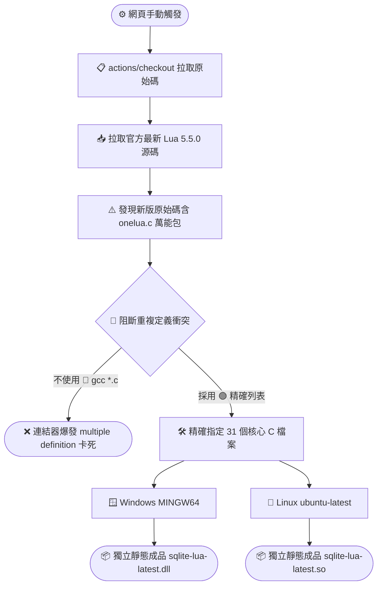

# 🚀 SQLite-Lua 延伸模組：升級 Lua 5.4 / 5.5 靜態編譯指南

本文件記錄了如何將 SQLite-Lua 延伸模組（自帶內嵌 Lua 引擎）升級至最新的 **Lua 5.4** 或 **Lua 5.5 版本**。

在新版架構中，由於 Lua 官方已原生支援 `lua_compare` 與 `LUA_OPEQ` 等現代 API，編譯時**完全不需要再使用任何代碼補丁（Polyfill）**。然而，針對新版原始碼獨有的「一鍵編譯機制」，我們採取了精確排除的編譯策略，以達到全平台（Windows DLL / Linux SO）的純靜態獨立封裝。

---

## 🧱 1. 自動化靜態編譯架構圖 (Lua 5.5 專用)



---

## 🛠️ 2. 全平台靜態編譯設定檔 (`.github/workflows/build-lua55.yml`)

請在專案的 `.github/workflows/` 目錄下建立此檔案。預設配置以 `abiliojr/sqlite-lua` 的 `src/lua.c` 結構為準。若要用於 `hoelzro` 專案，只需將指令中的 `src/lua.c` 改為 `lua.c` 即可。

```yaml
name: 🚀 Build Static - Lua 5.4 or 5.5 Latest

on:
  workflow_dispatch: # 完全手動觸發

jobs:
  # === Windows 靜態編譯 (獨立 DLL) ===
  build-windows-latest-lua:
    runs-on: windows-latest
    steps:
    - name: Checkout repository
      uses: actions/checkout@v4

    # 拉取官方最新的 Lua 5.5.0 原始碼 (若要 5.4.x 請將 ref 改為 v5.4.7)
    - name: Checkout Latest Lua Source
      uses: actions/checkout@v4
      with:
        repository: lua/lua
        ref: v5.5.0
        path: lua-src

    - name: Setup MSYS2
      uses: msys2/setup-msys2@v2
      with:
        msystem: MINGW64
        update: true
        install: >-
          mingw-w64-x86_64-gcc
          mingw-w64-x86_64-sqlite3

    # 關鍵修正：手動精確列出官方 31 個基礎核心檔案，主動跳過並封印 onelua.c
    - name: Build New Lua Static Lib (Windows)
      shell: msys2 {0}
      run: |
        cd lua-src
        gcc -O2 -c lapi.c lcode.c lctype.c ldebug.c ldo.c ldump.c lfunc.c lgc.c llex.c lmem.c lobject.c lopcodes.c lparser.c lstate.c lstring.c ltable.c ltm.c lundump.c lvm.c lzio.c lauxlib.c lbaselib.c lcorolib.c ldblib.c liolib.c lmathlib.c loslib.c lstrlib.c ltablib.c lutf8lib.c loadlib.c linit.c
        ar rcu liblua.a *.o
        ranlib liblua.a
        cd ..

    - name: Build Static DLL with Latest Lua
      shell: msys2 {0}
      run: |
        gcc -O2 -shared -o sqlite-lua-latest.dll src/lua.c \
          -Ilua-src \
          -I/mingw64/include \
          lua-src/liblua.a \
          -static-libgcc \
          -Wl,--export-all-symbols

    - name: Upload Windows DLL
      uses: actions/upload-artifact@v4
      with:
        name: sqlite-lua-v55-windows
        path: |
          *.dll
          README.md

  # === Linux 靜態編譯 (獨立 SO) ===
  build-linux-latest-lua:
    runs-on: ubuntu-latest
    steps:
    - name: Checkout repository
      uses: actions/checkout@v4

    # 拉取官方最新的 Lua 5.5.0 原始碼
    - name: Checkout Latest Lua Source
      uses: actions/checkout@v4
      with:
        repository: lua/lua
        ref: v5.5.0
        path: lua-src

    - name: Install System SQLite
      run: |
        sudo apt-get update
        sudo apt-get install -y build-essential libsqlite3-dev

    # 關鍵修正：Linux 端同樣精確指定核心檔案，強制帶上 -fPIC 參數避免連結重導向拒絕
    - name: Build New Lua Static Lib with fPIC (Linux)
      run: |
        cd lua-src
        gcc -O2 -fPIC -c lapi.c lcode.c lctype.c ldebug.c ldo.c ldump.c lfunc.c lgc.c llex.c lmem.c lobject.c lopcodes.c lparser.c lstate.c lstring.c ltable.c ltm.c lundump.c lvm.c lzio.c lauxlib.c lbaselib.c lcorolib.c ldblib.c liolib.c lmathlib.c loslib.c lstrlib.c ltablib.c lutf8lib.c loadlib.c linit.c
        ar rcu liblua.a *.o
        ranlib liblua.a
        cd ..

    - name: Build Static SO with Latest Lua
      run: |
        gcc -O2 -shared -fPIC -o sqlite-lua-latest.so src/lua.c \
          -Ilua-src \
          lua-src/liblua.a

    - name: Upload Linux SO
      uses: actions/upload-artifact@v4
      with:
        name: sqlite-lua-v55-linux
        path: |
          *.so
          README.md
```

---

## 🛠️ 3. 核心問題踩坑紀錄：排除 `onelua.c` 的重複定義衝突

### ❌ 遭遇錯誤現象
不論在 Windows 的 MinGW 還是 Linux 的 GCC 連結階段，皆會集體噴出數十行類似以下的致命錯誤：
`multiple definition of 'lua_newstate'; lua-src/liblua.a(lstate.o):lstate.c: first defined here`

### 🔍 錯誤根本原因分析
自 **Lua 5.4.7** 以及最新的 **Lua 5.5.0** 起，官方在原始碼目錄中新增了一個方便快速編譯的萬能包檔案 **`onelua.c`**。這個檔案本質上是一個「集合體」，內部使用 `#include` 把整個專案所有的核心 `.c` 檔案全部包裹進去了。

如果我們在建構腳本中使用傳統的 `gcc -c *.c` 巨集萬用字元，GCC 不僅會單獨編譯 `lstate.c` 等檔案，還會把包含了所有檔案的 `onelua.c` 再編譯一次。這導致封裝出來的 `liblua.a` 靜態庫內含有**雙倍重複的核心函式實作**，一與 SQLite 模組進行動態庫連結時，ld 連結器便會因為符號衝突而直接崩潰。

### 🟢 必勝防禦策略
直接揚棄 `*.c` 的模糊萬用字元編譯法。在 GitHub Actions 中**精確將 Lua 官方的 31 個獨立核心組件檔案完整列出**（如 `lapi.c`, `lcode.c` ... 至 `linit.c`）。這能完美確保 `onelua.c` 保持在未被編譯的冷凍狀態，徹底根絕重複定義衝突，此方法在雲端快取環境下具備 100% 的編譯穩定度。
