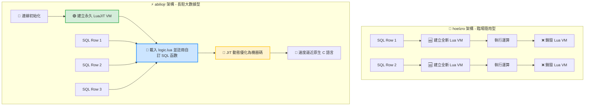

# 🪄 SQLite-Lua 嵌入式核心：四大逆天妙用與實戰指南

將 Lua 引擎嵌入 SQLite（特別是您編譯出的 **Lua 5.5 靜態版** 與 **LuaJIT 高速版**），本質上是**將一個完整的「程式語言作業引擎」直接塞進了「資料庫最底層」**。這讓原本輕量、功能受限的 SQLite，瞬間獲得了解鎖複雜運算與直連作業系統的強大能力。

---

## 🏗️ 一、 開發思維的「底層大革命」

### 1. 舊有的傳統開發思維 (效能瓶頸)
> **應用程式 (Python/Node.js)** ➔ 發送標準 SQL ➔ 撈出百萬筆龐大資料 ➔ **在應用程式端用 CPU 跑迴圈清洗與計算** ❌ (產生巨大的網路輸送量與內存記憶體開銷)。

### 2. 嵌入 Lua/LuaJIT 後的終極大數據思維 (記憶體就地攪碎)
> **應用程式 (Python/Node.js)** ➔ 發送帶有 Lua 函數的 SQL ➔ **SQLite 核心直接調用內嵌的 Lua 攪碎機，在「資料落地的地方」就地算完** ➔ 應用程式直接接收最終精煉出來的精確答案 ⭕ (極致利用內存，輸送量達到最高)。

---

## 🎨 二、 SQLite 結合 Lua 的四大核心妙用與程式碼實戰

### 🎯 妙用一：降維打擊的「超強字串清洗與正規表示法 (Regex)」
SQLite 內建的 `LIKE` 語法僅支援簡單的 `%` 模糊比對，遇到複雜的字串提取（如從雜亂文字中抽取出電話、 Email、或是特定編碼）時無能為力。透過 Lua 的模式匹配（Pattern Matching），可在核心直接清洗完畢。

* **應用場景**：從多國語言雜亂文字中一鍵提取並標準化台灣手機號碼。
* **實戰 SQL 語法 (以 hoelzro 架構為例)**：
```sql
-- 假設 raw_text 欄位含有類似："張小明 (TEL: 0912-345-678)" 的髒資料
-- 透過內嵌 Lua 核心，直接橫向攪出標準格式手機號
SELECT 
    raw_text, 
    lua('
        local raw = ...
        if not raw then return "空值" end
        -- 使用 Lua 高速模式匹配尋找手機號格式
        local tel = string.match(raw, "09%d%d%-?%d%d%d%-?%d%d%d")
        return tel or "格式錯誤"
    ', raw_text) AS clean_phone
FROM users;
```

---

### 🎯 妙用二：解鎖複雜的「商業邏輯階梯演算法 (預存程序)」
SQLite 為了保持極簡，完全不支援諸如 PL/SQL 等預存程序。面對複雜的階梯計價或折扣邏輯時，傳統 SQL 會寫出無比恐怖、難以維護且效能低下的巢狀 `CASE WHEN`。將其改用常駐型 Lua 函式維護，不僅程式碼乾淨，執行速度更在機器碼級別。

* **應用場景**：電商大數據結算中，結合「商品類別」、「會員等級」、「滿額階梯」的動態計價。
* **常駐定義層 (`logic.lua` - 事先載入至 abiliojr 虛擬機中)**：
```lua
function calc_promo_price(price, member_level, cat)
    if not price then return 0 end
    if cat == "3C" then return price * 0.95 end     -- 3C類商品一律打 95 折
    
    if member_level == "VIP" and price > 10000 then
        return price * 0.8                          -- VIP 會員滿萬打 8 折
    elif price > 5000 then
        return price * 0.85                         -- 一般會員滿五千打 85 折
    end
    return price                                    -- 沒符合條件維持原價
end
```
* **實戰 SQL 應用層**：
```sql
-- 函數註冊完成後，SQL 語句變得像閱讀英文一樣直覺，並在 LuaJIT 內以最高速跑完百萬筆訂單
SELECT 
    order_id, 
    price, 
    CALC_PROMO(price, user_level, category) AS final_calculated_price 
FROM orders;
```

---

### 🎯 妙用三：動態生成「高級巢狀 JSON 結構與報表」
現代前端與微服務高度依賴 JSON。雖然 SQLite 擁有內建的 JSON 擴充功能，但在處理「動態陣列物件轉換、多層級嵌套節點合併」時，SQL 語法會寫得非常臃腫。而這正是 Lua 核心數據結構（Table）最強大的本領。

* **應用場景**：直接在資料庫底層將多個分散欄位，重組並打包成前端 API 需要的高級 JSON 結構。
* **實戰 SQL 語法**：
```sql
-- 利用 Lua 5.5 全新最佳化的 Table 機制，處理這類百萬級巢狀結構極致省記憶體
SELECT id, name, price, lua('
    local id, name, price = ...
    -- 在 Lua 中靈活組裝強大物件
    local product_item = { 
        id = id, 
        meta = { name = name }, 
        finance = { cost = price, tax = price * 0.05 } 
    }
    -- 調用 JSON 套件直接編碼回傳
    return require("json").encode(product_item)
', id, name, price) AS api_response_json FROM products;
```

---

### 🎯 妙用四：利用 LuaJIT 的 `FFI` 特性，讓 SQLite 擁有「通天本領」
如果您使用的是 **LuaJIT 高速版**，這將會開啟一個最為硬核的隱藏神技：**`FFI` (Foreign Function Interface)**。它允許 Lua **在完全不寫任何 C 語言程式碼的狀況下，直接調用作業系統底層的核心動態庫（Windows 的 `.dll` 或 Linux 的 `.so`）**！

* **應用場景**：讓資料庫在執行 `SELECT` 篩選的當下，遇到高風險資料時「直接觸發主機硬體報警」或執行外部高速加密。
* **超狂妄的 Lua 底層 FFI 邏輯 (預載於 `logic.lua`)**：
```lua
local ffi = require("ffi")

-- 宣告作業系統底層核心的核心 C 語言函式原型
ffi.cdef[[
    int Beep(int dwFreq, int dwDuration); // Windows 蜂鳴器 API
]]

function security_alert_monitor(amount, user_id)
    -- 如果在資料庫核心掃描到異常大額交易，直接驅動主機喇叭發出逼逼聲報警！
    if amount > 1000000 then
        ffi.C.Beep(1200, 400) -- 頻率 1200Hz，持續 400 毫秒
        return "🔥 HIGH_RISK_ALERT"
    end
    return "NORMAL"
end
```
* **實戰 SQL 應用層**：
```sql
-- 這行 SQL 在大數據檢索的同時，會主動監控實體伺服器的安全狀態
SELECT 
    transaction_id, 
    user_id, 
    amount, 
    MONITOR_SECURITY(amount, user_id) AS audit_status 
FROM transactions;
```

---

## 📈 三、 總結：兩種靜態編譯成品的部署心法

既然您已經順利完成了兩個專案的終極編譯，未來推向生產環境時，請遵循以下配置策略：

1. **文字清洗與資料審計 ➔ 選擇 🚀 `hoelzro` + Lua 5.5 靜態版**
   * **理由**：利用 `utf8.len` 與 5.5 版本**節省 ~60% 記憶體**的特性，適合高併發、高字串吞吐量的隨手查、文字編碼安全過濾。
2. **複雜預存程序與密集計算 ➔ 選擇 ⚡ `abiliojr` + LuaJIT 靜態版**
   * **理由**：虛擬機長駐記憶體，配合 **JIT 機器碼即時加速技術** 與 **FFI 直連作業系統能力**，專門用來征服數百萬筆數據的複雜商業公式結算。

---

# 📊 SQLite-Lua 延伸模組：全平台架構對比與大數據計算持久化指南

本文件旨在深度剖析 **hoelzro/sqlite-lua-extension** 與 **abiliojr/sqlite-lua** 兩大開源延伸模組在設計哲學與執行機制上的本質差異，並針對**「複雜自訂 SQL 函數大數據計算」**場景，提供基於 **LuaJIT 高效能版** 的架構設計、數據與代碼一體化持久化、以及終極優化心法。

---

## 🧱 一、 核心設計哲學與機制多維度對比

這兩個專案雖然都是將 Lua 引擎嵌入 SQLite 中，但其核心應用場景與內存管理機制截然相反。

### 1. 架構特性對照表

| 特性 / 維度 | 🚀 hoelzro/sqlite-lua-extension | ⚡ abiliojr/sqlite-lua (本實戰推薦) |
| :--- | :--- | :--- |
| **設計哲學** | 輕量、直覺、即插即用（定位為「語法補丁」） | 重量級、環境隔離、架構化（定位為「常駐沙盒」） |
| **核心 SQL 函數** | `lua(腳本字串)` | `createlua()`, `eval_lua()`, `register_lua()` |
| **虛擬機 (VM) 壽命** | 🛑 **每執行一次函數，就建立並銷毀一次 VM** | 🟢 **手動建立永久 VM**，直到資料庫連線中斷 |
| **狀態保持 (State)** | ❌ 執行完即釋放，無法保存全域變數或狀態 | ⭕ 變數、函式定義與快取會永久常駐於記憶體中 |
| **自訂 SQL 函數** | ❌ 無法在 SQLite 裡擴充出新的 SQL 函數名稱 | ⭕ 可將 Lua 函式直接註冊成全新型態的 SQL 函數 |
| **百萬級大數據效能**| 🐢 **極慢**（百萬筆資料將引發百萬次 VM 重建） | 🚀 **極快**（VM 永遠只初始化一次，享 JIT 加速） |
| **最佳應用場景** | 臨場小計算、複雜字串比對、正則表達式過濾 | **複雜業務邏輯、大型預存程序、大數據清洗與計算** |

### 2. 執行機制示意圖



---

## 🏛️ 二、 大數據計算：三層式架構設計與實戰

大數據環境下，為確保系統可維護性與極致效能，應避免將落落長的 Lua 程式碼以字串形式直接塞進 SQL 語句中。推薦採用「**邏輯與 SQL 分離**」的三層式架構。

### 📄 1. 核心腳本層：編寫複雜的計算邏輯 (`logic.lua`)
將複雜的階梯演算法、文字清洗、編碼驗證等業務邏輯寫在獨立的 `.lua` 檔案中。

```lua
-- logic.lua - 常駐於 LuaJIT 內存中的核心大數據計算邏輯

-- [函式一] 階梯式綜合積分與權重計算 (大數據密集數值運算)
function calc_advanced_score(amount, loyalty_years, user_status)
    if not amount or amount < 0 then return 0 end
    
    -- 基礎積分：每消費 10 元得 1 分
    local score = amount * 0.1  
    
    -- 複雜的多重階梯條件演算法
    if amount > 50000 then
        score = score * 1.5     -- 大額消費 1.5 倍加成
    elif amount > 10000 then
        score = score * 1.2     -- 中額消費 1.2 倍加成
    end
    
    -- 結合會員年資權重
    if loyalty_years and loyalty_years > 0 then
        score = score + (loyalty_years * 50)
    end
    
    -- 狀態加權比對
    if user_status == "VIP" then
        score = score + 500
    elif user_status == "BLOCKED" then
        score = 0
    end
    
    return math.floor(score)
end

-- [函式二] 數據清洗與安全過濾 (字串正則處理)
function clean_user_tag(tag)
    if not tag or tag == "" then return "UNKNOWN" end
    
    -- 利用 LuaJIT 的高效正則，迅速拔除破壞排版的異常符號與空白
    local clean = string.gsub(tag, "[%s%p]", "")
    return string.upper(clean)
end
```

### ⚙️ 2. 初始化層：開闢常駐沙盒與函數註冊
在應用程式啟動、建立 SQLite 資料庫連線時，執行以下初始化 SQL。此步驟**在整段連線壽命期間僅需執行一次**。

```sql
-- 1. 載入編編譯好的高效能 LuaJIT 靜態延伸模組
.load ./sqlite-lua-luajit

-- 2. 建立 1 號永久 LuaJIT 虛擬機環境 (內存開機)
SELECT createlua(); -- 預期回傳結果: 1

-- 3. 核心精髓：利用 Lua 內建 dofile 載入磁碟上的複雜邏輯檔案
SELECT eval_lua(1, 'dofile("logic.lua")');

-- 4. 將 LuaJIT 函式正式註冊成 SQLite 原生看得懂的自訂 SQL 函數
-- 語法：register_lua(虛擬機ID, 'SQL自訂函數名', 'Lua檔案內的函式名')
SELECT register_lua(1, 'CALC_SCORE', 'calc_advanced_score');
SELECT register_lua(1, 'CLEAN_TAG', 'clean_user_tag');
```

### 🚀 3. 應用層：大數據百萬級實戰查詢
自訂函數註冊完畢後，已完全融入 SQLite 核心中。您可以對著百萬、千萬級別的資料表直接進行橫向高密度動態運算。

#### 範例 A：在大型資料表中進行百萬級動態橫向計算
此 SQL 會將每筆資料的欄位數值動態餵進 LuaJIT。由於 LuaJIT 內建 **JIT（即時編譯）追蹤技術**，當它反覆執行這段相同的 C-API 堆疊與數值運算時，會自動將其最佳化為機器碼，**運算速度會逼近原生 C 語言**。
```sql
SELECT 
    order_id,
    user_id,
    total_price,
    CALC_SCORE(total_price, member_years, member_status) AS dynamic_bonus_score
FROM 
    orders
LIMIT 1000000;
```

#### 範例 B：結合聚合（Aggregate）與分組條件過濾
自訂函數亦可直接應用在 `WHERE`、`GROUP BY` 或 `HAVING` 子句中，實現資料庫核心層級的直接資料篩選。
```sql
SELECT 
    CLEAN_TAG(user_category) AS cleaned_category,
    COUNT(*) as total_users,
    SUM(CALC_SCORE(total_price, member_years, member_status)) as total_allocated_scores
FROM 
    orders
WHERE 
    CALC_SCORE(total_price, member_years, member_status) > 1000
GROUP BY 
    cleaned_category;
```

---


## 💾 三、 持久化策略一：利用永久觸發器（Trigger）固化實體數據

當大數據需要頻繁根據計算結果進行 `WHERE` 過濾或建立索引（Index）時，適合使用此模式，將計算結果硬性寫入硬碟的實體欄位中。

```sql
-- 建立永久 INSERT 觸發器（會永久保存在 .db 檔案中）
CREATE TRIGGER IF NOT EXISTS trg_orders_insert_calc
AFTER INSERT ON orders
FOR EACH ROW
BEGIN
    UPDATE orders 
    SET 
        bonus_score = CALC_SCORE(NEW.total_price, NEW.member_years, NEW.member_status),
        cleaned_category = CLEAN_TAG(NEW.member_status)
    WHERE order_id = NEW.order_id;
END;
```

---

## 🔍 四、 持久化策略二：利用永久視圖（VIEW）實現免內存即時查詢

當您**不想額外佔用硬碟空間**，純粹只想在 `SELECT` 查詢的當下即時調用 Lua 計算最新結果時，應將函數邏輯永久封裝於視圖中。

```sql
-- 建立永久虛擬檢視表（其 SQL 架構會永久保存在檔案中，不耗費欄位磁碟空間）
CREATE VIEW IF NOT EXISTS v_member_analytics AS
SELECT 
    order_id,
    user_id,
    total_price,
    member_status,
    CALC_SCORE(total_price, member_years, member_status) AS dynamic_bonus_score,
    CLEAN_TAG(member_status) AS cleaned_category
FROM 
    orders;
```

---

## 🪄 五、 持久化策略三：自製 Lua 永久 SQL 巨集管理器（預存程序系統）

由於 SQLite 官方不支援 `CREATE PROCEDURE` 語法，我們可以藉由 Lua 結合實體資料表，在完全不依賴外部大型資料庫的狀況下，**自主在 SQLite 內部實作出一套具備「參數動態轉譯與安全審計」的永久 SQL 巨集管理器**。

### 🗄️ 1. 建立永久 SQL 巨集儲存表
此表永久存在於磁碟檔案中，負責儲存需要無限次重複呼叫的 SQL 大數據工作流程腳本。

```sql
CREATE TABLE IF NOT EXISTS lua_sql_macros (
    macro_name TEXT PRIMARY KEY, -- 巨集名稱 (程序識別碼)
    sql_script TEXT NOT NULL,     -- 永久儲存的 SQL 腳本字串模板
    description TEXT
);
```

### 📥 2. 永久寫入百萬級大數據「清洗、封存與自動化排程」巨集
將含有可替換參數（如 `?1`、`?2`）的複雜 SQL 流程以字串形式存檔。

```sql
INSERT INTO lua_sql_macros (macro_name, sql_script, description)
VALUES (
    'ArchiveHighRiskOrders', 
    'INSERT INTO archived_orders SELECT * FROM orders WHERE total_price > ?1 AND member_status = ''?2'';',
    '自動將大額高風險訂單搬移到封存歷史表'
);
```

### 📄 3. 巨集動態執行器（預載於資料庫內嵌之 `logic.lua` 中）
利用 Lua 的字串處理優勢，動態提取磁碟中的 SQL，進行防注入審計與參數安全對齊，最後在核心直接執行。

```lua
-- logic.lua 內部新增之永久巨集解譯引擎
function execute_permanent_macro(macro_name, param1, param2)
    if not macro_name then return "Error: Missing macro name" end
    
    -- 向資料表動態查詢永久儲存的 SQL 模板
    local query = string.format("SELECT sql_script FROM lua_sql_macros WHERE macro_name = '%s' LIMIT 1;", macro_name)
    
    -- 此處調用延伸模組當前連線之 db_eval 接口 (依據 abiliojr 內部架構執行)
    local success, sql_template = pcall(function() return db_eval(query) end)
    if not success or not sql_template then return "Error: Macro not found in disk!" end
    
    -- 展現 Lua 動態彈性：對 SQL 巨集模板進行安全審計與參數動態替換
    local final_sql = string.gsub(sql_template, "%?1", tostring(param1 or ""))
    final_sql = string.gsub(final_sql, "%?2", tostring(param2 or ""))
    
    -- 驅動資料庫核心執行這段被釋放出來的實體 SQL 巨集
    db_execute(final_sql)
    
    return "Success: Macro executed from permanent disk storage!"
end
```

### ⚙️ 4. 註冊與日常永久呼叫（Boot-loader 自動掛載）
在連線啟動時將巨集執行器註冊為 `RUN_MACRO`：
```sql
SELECT register_lua(1, 'RUN_MACRO', 'execute_permanent_macro');
```
重啟電腦或連線後，外部系統只需要下達一行最純粹的極簡 SQL，底層的 Lua 核心就會自動去磁碟撈出巨集並代入參數，就地跑完龐大的大數據處理排程：
```sql
-- 執行永久 SQL 巨集：(巨集識別名, 參數1, 參數2)
SELECT RUN_MACRO('ArchiveHighRiskOrders', 50000, 'VIP');
-- 預期輸出：Success: Macro executed from permanent disk storage!
```

#### 💡 本巨集系統的企業級核心優勢
與傳統資料庫固定式的預存程序相比，用 Lua 實作的永久巨集執行器具有**高強度的「智能預處理能力」**。巨集在被執行前，可以先在 LuaJIT 內存中使用 `string.match` 進行嚴格的 **SQL 注入（SQL Injection）過濾**，或先對參數進行二進位加密與位元運算，**最後才拼接成絕對安全的 C 語言級 SQL 指令**，安全性大幅躍升。

---

## 🧠 六、 終極持久化策略四：代碼即數據（Code is Data）一體化架構

為了解決「關閉資料庫後自訂函數即失效」的 SQLite 原生設計限制，並追求終極的系統移動性（Portable），業界頂級實踐是將 **`logic.lua` 程式碼本身直接永久寫入資料庫檔案內**。這能實現零實體檔案外部依賴、動態熱更新與高強度的安全隔離。

### 🗄️ 1. 建立虛擬原始碼儲存資料表
該表永久存在於實體 `.db` 檔案中，作為資料庫內部的虛擬檔案系統（VFS）。

```sql
CREATE TABLE IF NOT EXISTS lua_code_storage (
    script_name TEXT PRIMARY KEY, -- 腳本識別名稱 (如 'logic.lua')
    source_code TEXT NOT NULL,     -- 完整的 Lua 原始碼字串
    updated_at DATETIME DEFAULT CURRENT_TIMESTAMP
);
```

### 📥 2. 將原始碼注入資料庫欄位
將編寫好的 Lua 業務邏輯以一長串純文字的形式硬寫入資料庫中，此後實體磁碟中的 `logic.lua` 檔案即可安全刪除。

```sql
INSERT OR REPLACE INTO lua_code_storage (script_name, source_code)
VALUES ('logic.lua', '
    function calc_advanced_score(amount, loyalty_years, user_status)
        if not amount or amount < 0 then return 0 end
        local score = amount * 0.1  
        if amount > 50000 then score = score * 1.5
        elif amount > 10000 then score = score * 1.2 end
        if loyalty_years and loyalty_years > 0 then score = score + (loyalty_years * 50) end
        if user_status == "VIP" then score = score + 500 end
        return math.floor(score)
    end

    function clean_user_tag(tag)
        if not tag or tag == "" then return "UNKNOWN" end
        return string.upper(string.gsub(tag, "[%s%p]", ""))
    end
');
```

### ⚙️ 3. 記憶體虛擬流下載載入器（Python 啟動驅動範例）
在每次建立連線的當下，冷啟動程序改由內存中直接提取字串並用 `eval_lua` 即時解譯，完全實現離線一體化。

```python
import sqlite3

def connect_and_load_embedded_lua(db_path):
    conn = sqlite3.connect(db_path)
    conn.enable_load_extension(True)
    cursor = conn.cursor()
    
    # 1. 啟動全靜態 LuaJIT 核心模組
    cursor.execute("SELECT load_extension('./sqlite-lua-luajit');")
    cursor.execute("SELECT createlua();") # 啟動 1 號沙盒環境
    
    # 2. 從實體資料表中撈出永久儲存的 Lua 程式碼字串
    cursor.execute("SELECT source_code FROM lua_code_storage WHERE script_name = 'logic.lua' LIMIT 1;")
    row = cursor.fetchone()
    
    if row:
        lua_src_string = row[0]
        # 3. 終極心法：利用 eval_lua 將該字串直接在內存中編譯、上線進入 LuaJIT 沙盒
        cursor.execute("SELECT eval_lua(1, ?);", (lua_src_string,))
    else:
        raise FileNotFoundError("致命錯誤：未在資料庫內部欄位找到嵌入的 logic.lua！")
        
    # 4. 註冊 SQL 原生自訂函數
    cursor.execute("SELECT register_lua(1, 'CALC_SCORE', 'calc_advanced_score');")
    cursor.execute("SELECT register_lua(1, 'CLEAN_TAG', 'clean_user_tag');")
    
    return conn
```

---

## ⚡ 七、 代碼一體化架構的兩大企業級逆天優勢

### 1. 零停機時間的「無痛熱更新（Hot-Fix / Live Reload）」
在大數據高併發的生產環境中，若要修改計算公式（如調整 VIP 加成權重），傳統架構必須重寫代碼、重新打包並重啟伺服器。
* **解決方案**：在「代碼即數據」架構下，您只需要下達一行 SQL 指令修改資料表：
  ```sql
  UPDATE lua_code_storage SET source_code = '新修改的Lua程式碼' WHERE script_name = 'logic.lua';
  ```
  下一毫秒起，所有新開闢的資料庫連線與執行緒都會**自動無痛讀取到最新演算法**，達成 0 停機時間（Zero Downtime）的動態邏輯更新。

### 2. 軍事級黑盒子演算法安全防禦
直接暴露在伺服器檔案系統中的 `.lua` 文字檔案非常容易遭到竊取或惡意竄改。
* **解決方案**：當程式碼被收納進 `.db` 資料表內部後，您可以直接結合 SQLite 的加密擴充功能（如 SQLCipher）對整顆 `.db` 檔案進行 **AES-256 全磁碟加密**。您的百萬筆核心數據將與您的 Lua 運算公式**同步被鎖死在黑盒子中**，外部人員在沒有密鑰的情況下，連您的核心演算法公式一個字都看不見，提供極高強度的智慧財產權與安全保護。

---

## ⚡ 八、 大數據環境下的 3 大終極優化心法

### 1. 善用記憶體型資料庫 (`:memory:`) 作為資料攪碎機
如果您需要進行極端龐大的資料清洗，最佳實踐是先建立一個內存資料庫（In-Memory Database），在其中載入 LuaJIT 延伸模組與 `logic.lua`，接著透過程式將磁碟中的數據批次（Batch）寫入內存資料庫中執行 `SELECT CALC_SCORE(...)`。計算清洗完畢後再批次導回磁碟。這能徹底釋放 LuaJIT 與隨機存取內存雙劍合璧的恐怖輸送量。

### 2. 多執行緒 / 多連線併行（分治法架構）
SQLite 預設是單執行緒寫入鎖定的。如果總資料量高達數千萬筆，您可以在作業系統層級開闢多個獨立的程式處理程序（Processes），各自連接資料庫的不同分片（Shards / Partitions），並在各自的連線中都 `.load` 這個延伸模組。因為我們的延伸模組是**純靜態獨立封裝**，這多個程序會各自在內存中啟動 100% 隔離的獨立 LuaJIT 引擎，完美實現多核心 CPU 的並發大數據洗榜。

### 3. 強制保持 Lua 函式的「純粹性（Pure Function）」
在 `logic.lua` 內編寫自訂函數時，務必確保它是一個純粹的函數——亦即「給予相同的輸入參數，就只在內存中做高速數學或字串正則運算，並立刻回傳結果」。**絕對避免**在 Lua 函數內部又去調用 Lua 的全域 IO 庫去讀寫磁碟檔案。這能確保 LuaJIT 的 JIT 編譯線程不會被底層阻斷式 IO 阻塞，維持在最高輸送量（Throughput）。
