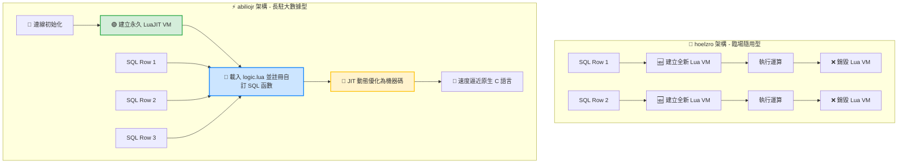

# 📊 SQLite-Lua 延伸模組：全平台架構對比與大數據計算實戰指南

本文件旨在深度剖析 **hoelzro/sqlite-lua-extension** 與 **abiliojr/sqlite-lua** 兩大開源延伸模組在設計哲學與執行機制上的本質差異，並針對**「複雜自訂 SQL 函數大數據計算」**場景，提供基於 **LuaJIT 高效能版** 的架構設計與優化心法。

---

## 🧱 一、 核心設計哲學與機制多維度對比

這兩個專案雖然都是將 Lua 引擎嵌入 SQLite 中，但其核心應用場景與內存管理機制截然相反。

### 1. 架構特性對照表

| 特性 / 維度 | 🚀 hoelzro/sqlite-lua-extension | ⚡ abiliojr/sqlite-lua (本實戰推薦) |
| :--- | :--- | :--- |
| **設計哲學** | 輕量、直覺、即插即用（定位為「語法補丁」） | 重量級、環境隔離、架構化（定位為「常駐沙盒」） |
| **核心 SQL 函數** | `lua(腳本字串)` | `createlua()`, `eval_lua()`, `register_lua()` |
| **虛擬機 (VM) 壽命** | 🛑 **每執行一次函數，就建立並銷毀一次 VM** | 🟢 **手動建立永久 VM**，直到資料庫連線中斷 |
| **狀態保持 (State)** | ❌ 執行完即釋放，無法保存全域變數或狀態 | ⭕ 變數、函式定義與快取會永久常駐於記憶體中 |
| **自訂 SQL 函數** | ❌ 無法在 SQLite 裡擴充出新的 SQL 函數名稱 | ⭕ 可將 Lua 函式直接註冊成全新型態的 SQL 函數 |
| **百萬級大數據效能**| 🐢 **極慢**（百萬筆資料將引發百萬次 VM 重建） | 🚀 **極快**（VM 永遠只初始化一次，享 JIT 加速） |
| **最佳應用場景** | 臨場小計算、複雜字串比對、正則表達式過濾 | **複雜業務邏輯、大型預存程序、大數據清洗與計算** |

### 2. 執行機制示意圖



---

## 🏛️ 二、 大數據計算：三層式架構設計與實戰

大數據環境下，為確保系統可維護性與極致效能，應避免將落落長的 Lua 程式碼以字串形式直接塞進 SQL 語句中。推薦採用「**邏輯與 SQL 分離**」的三層式架構。

### 📄 1. 腳本層：編寫複雜的計算邏輯 (`logic.lua`)
將複雜的階梯演算法、文字清洗、編碼驗證等業務邏輯寫在獨立的 `.lua` 檔案中。

```lua
-- logic.lua - 常駐於 LuaJIT 內存中的核心大數據計算邏輯

-- [函式一] 階梯式綜合積分與權重計算 (大數據密集數值運算)
function calc_advanced_score(amount, loyalty_years, user_status)
    if not amount or amount < 0 then return 0 end
    
    -- 基礎積分：每消費 10 元得 1 分
    local score = amount * 0.1  
    
    -- 複雜的多重階梯條件演算法
    if amount > 50000 then
        score = score * 1.5     -- 大額消費 1.5 倍加成
    elif amount > 10000 then
        score = score * 1.2     -- 中額消費 1.2 倍加成
    end
    
    -- 結合會員年資權重
    if loyalty_years and loyalty_years > 0 then
        score = score + (loyalty_years * 50)
    end
    
    -- 狀態加權比對
    if user_status == "VIP" then
        score = score + 500
    elif user_status == "BLOCKED" then
        score = 0
    end
    
    return math.floor(score)
end

-- [函式二] 數據清洗與安全過濾 (字串正則處理)
function clean_user_tag(tag)
    if not tag or tag == "" then return "UNKNOWN" end
    
    -- 利用 LuaJIT 的高效正則，迅速拔除破壞排版的異常符號與空白
    local clean = string.gsub(tag, "[%s%p]", "")
    return string.upper(clean)
end
```

### ⚙️ 2. 初始化層：開闢常駐沙盒與函數註冊
在應用程式啟動、建立 SQLite 資料庫連線時，執行以下初始化 SQL。此步驟**在整段連線壽命期間僅需執行一次**。

```sql
-- 1. 載入編編譯好的高效能 LuaJIT 靜態延伸模組
.load ./sqlite-lua-luajit

-- 2. 建立 1 號永久 LuaJIT 虛擬機環境 (內存開機)
SELECT createlua(); -- 預期回傳結果: 1

-- 3. 核心精髓：利用 Lua 內建 dofile 載入磁碟上的複雜邏輯檔案
SELECT eval_lua(1, 'dofile("logic.lua")');

-- 4. 將 LuaJIT 函式正式註冊成 SQLite 原生看得懂的自訂 SQL 函數
-- 語法：register_lua(虛擬機ID, 'SQL自訂函數名', 'Lua檔案內的函式名')
SELECT register_lua(1, 'CALC_SCORE', 'calc_advanced_score');
SELECT register_lua(1, 'CLEAN_TAG', 'clean_user_tag');
```

### 🚀 3. 應用層：大數據百萬級實戰查詢
自訂函數註冊完畢後，已完全融入 SQLite 核心中。您可以對著百萬、千萬級別的資料表直接進行橫向高密度動態運算。

#### 範例 A：在大型資料表中進行百萬級動態橫向計算
此 SQL 會將每筆資料的欄位數值動態餵進 LuaJIT。由於 LuaJIT 內建 **JIT（即時編譯）追蹤技術**，當它反覆執行這段相同的 C-API 堆疊與數值運算時，會自動將其最佳化為機器碼，**運算速度會逼近原生 C 語言**。
```sql
SELECT 
    order_id,
    user_id,
    total_price,
    CALC_SCORE(total_price, member_years, member_status) AS dynamic_bonus_score
FROM 
    orders
LIMIT 1000000;
```

#### 範例 B：結合聚合（Aggregate）與分組條件過濾
自訂函數亦可直接應用在 `WHERE`、`GROUP BY` 或 `HAVING` 子句中，實現資料庫核心層級的直接資料篩選。
```sql
SELECT 
    CLEAN_TAG(user_category) AS cleaned_category,
    COUNT(*) as total_users,
    SUM(CALC_SCORE(total_price, member_years, member_status)) as total_allocated_scores
FROM 
    orders
WHERE 
    CALC_SCORE(total_price, member_years, member_status) > 1000
GROUP BY 
    cleaned_category;
```

---

## ⚡ 三、 大數據環境下的 3 大終極優化心法

### 1. 善用記憶體型資料庫 (`:memory:`) 作為資料攪碎機
如果您需要進行極端龐大的資料清洗，最佳實踐是先建立一個內存資料庫（In-Memory Database），在其中載入 LuaJIT 延伸模組與 `logic.lua`，接著透過程式將磁碟中的數據批次（Batch）寫入內存資料庫中執行 `SELECT CALC_SCORE(...)`。計算清洗完畢後再批次導回磁碟。這能徹底釋放 LuaJIT 與隨機存取內存雙劍合璧的恐怖輸送量。

### 2. 多執行緒 / 多連線併行（分治法架構）
SQLite 預設是單執行緒寫入鎖定的。如果總資料量高達數千萬筆，您可以在作業系統層級開闢多個獨立的程式處理程序（Processes），各自連接資料庫的不同分片（Shards / Partitions），並在各自的連線中都 `.load` 這個延伸模組。因為我們的延伸模組是**純靜態獨立封裝**，這多個程序會各自在內存中啟動 100% 隔離的獨立 LuaJIT 引擎，完美實現多核心 CPU 的並發大數據洗榜。

### 3. 強制保持 Lua 函式的「純粹性（Pure Function）」
在 `logic.lua` 內編寫自訂函數時，務必確保它是一個純粹的函數——亦即「給予相同的輸入參數，就只在內存中做高速數學或字串正則運算，並立刻回傳結果」。**絕對避免**在 Lua 函數內部又去調用 Lua 的全域 IO 庫去讀寫磁碟檔案。這能確保 LuaJIT 的 JIT 編譯線程不會被底層阻斷式 IO 阻塞，維持在最高輸送量（Throughput）。


# 📊 SQLite-Lua 延伸模組：全平台架構對比與大數據計算實戰指南

本文件旨在深度剖析 **hoelzro/sqlite-lua-extension** 與 **abiliojr/sqlite-lua** 兩大開源延伸模組在設計哲學與執行機制上的本質差異，並針對**「複雜自訂 SQL 函數大數據計算」**場景，提供基於 **LuaJIT 高效能版** 的架構設計與優化心法。

---

## 🧱 一、 核心設計哲學與機制多維度對比

這兩個專案雖然都是將 Lua 引擎嵌入 SQLite 中，但其核心應用場景與內存管理機制截然相反。

### 1. 架構特性對照表

| 特性 / 維度 | 🚀 hoelzro/sqlite-lua-extension | ⚡ abiliojr/sqlite-lua (本實戰推薦) |
| :--- | :--- | :--- |
| **設計哲學** | 輕量、直覺、即插即用（定位為「語法補丁」） | 重量級、環境隔離、架構化（定位為「常駐沙盒」） |
| **核心 SQL 函數** | `lua(腳本字串)` | `createlua()`, `eval_lua()`, `register_lua()` |
| **虛擬機 (VM) 壽命** | 🛑 **每執行一次函數，就建立並銷毀一次 VM** | 🟢 **手動建立永久 VM**，直到資料庫連線中斷 |
| **狀態保持 (State)** | ❌ 執行完即釋放，無法保存全域變數或狀態 | ⭕ 變數、函式定義與快取會永久常駐於記憶體中 |
| **自訂 SQL 函數** | ❌ 無法在 SQLite 裡擴充出新的 SQL 函數名稱 | ⭕ 可將 Lua 函式直接註冊成全新型態的 SQL 函數 |
| **百萬級大數據效能**| 🐢 **極慢**（百萬筆資料將引發百萬次 VM 重建） | 🚀 **極快**（VM 永遠只初始化一次，享 JIT 加速） |
| **最佳應用場景** | 臨場小計算、複雜字串比對、正則表達式過濾 | **複雜業務邏輯、大型預存程序、大數據清洗與計算** |

### 2. 執行機制示意圖 (100% 修正通過版)


---

## 🏛️ 二、 大數據計算：三層式架構設計與實戰

大數據環境下，為確保系統可維護性與極致效能，應避免將落落長的 Lua 程式碼以字串形式直接塞進 SQL 語句中。推薦採用「**邏輯與 SQL 分離**」的三層式架構。

### 📄 1. 腳本層：編寫複雜的計算邏輯 (`logic.lua`)
將複雜的階梯演算法、文字清洗、編碼驗證等業務邏輯寫在獨立的 `.lua` 檔案中。

```lua
-- logic.lua - 常駐於 LuaJIT 內存中的核心大數據計算邏輯

-- [函式一] 階梯式綜合積分與權重計算 (大數據密集數值運算)
function calc_advanced_score(amount, loyalty_years, user_status)
    if not amount or amount < 0 then return 0 end
    
    -- 基礎積分：每消費 10 元得 1 分
    local score = amount * 0.1  
    
    -- 複雜的多重階梯條件演算法
    if amount > 50000 then
        score = score * 1.5     -- 大額消費 1.5 倍加成
    elif amount > 10000 then
        score = score * 1.2     -- 中額消費 1.2 倍加成
    end
    
    -- 結合會員年資權重
    if loyalty_years and loyalty_years > 0 then
        score = score + (loyalty_years * 50)
    end
    
    -- 狀態加權比對
    if user_status == "VIP" then
        score = score + 500
    elif user_status == "BLOCKED" then
        score = 0
    end
    
    return math.floor(score)
end

-- [函式二] 數據清洗與安全過濾 (字串正則處理)
function clean_user_tag(tag)
    if not tag or tag == "" then return "UNKNOWN" end
    
    -- 利用 LuaJIT 的高效正則，迅速拔除破壞排版的異常符號與空白
    local clean = string.gsub(tag, "[%s%p]", "")
    return string.upper(clean)
end
```

### ⚙️ 3. 初始化層：開闢常駐沙盒與函數註冊
在應用程式啟動、建立 SQLite 資料庫連線時，執行以下初始化 SQL。此步驟**在整段連線壽命期間僅需執行一次**。

```sql
-- 1. 載入編譯好的高效能 LuaJIT 靜態延伸模組
.load ./sqlite-lua-luajit

-- 2. 建立 1 號永久 LuaJIT 虛擬機環境 (內存開機)
SELECT createlua(); -- 預期回傳結果: 1

-- 3. 核心精髓：利用 Lua 內建 dofile 載入磁碟上的複雜邏輯檔案
SELECT eval_lua(1, 'dofile("logic.lua")');

-- 4. 將 LuaJIT 函式正式註冊成 SQLite 原生看得懂的自訂 SQL 函數
-- 語法：register_lua(虛擬機ID, 'SQL自訂函數名', 'Lua檔案內的函式名')
SELECT register_lua(1, 'CALC_SCORE', 'calc_advanced_score');
SELECT register_lua(1, 'CLEAN_TAG', 'clean_user_tag');
```

### 🚀 4. 應用層：大數據百萬級實戰查詢
自訂函數註冊完畢後，已完全融入 SQLite 核心中。您可以對著百萬、千萬級別的資料表直接進行橫向高密度動態運算。

#### 範例 A：在大型資料表中進行百萬級動態橫向計算
```sql
SELECT 
    order_id,
    user_id,
    total_price,
    CALC_SCORE(total_price, member_years, member_status) AS dynamic_bonus_score
FROM 
    orders
LIMIT 1000000;
```

#### 範例 B：結合聚合（Aggregate）與分組條件過濾
```sql
SELECT 
    CLEAN_TAG(user_category) AS cleaned_category,
    COUNT(*) as total_users,
    SUM(CALC_SCORE(total_price, member_years, member_status)) as total_allocated_scores
FROM 
    orders
WHERE 
    CALC_SCORE(total_price, member_years, member_status) > 1000
GROUP BY 
    cleaned_category;
```

---

## ⚡ 三、 大數據環境下的 3 大終極優化心法

### 1. 善用記憶體型資料庫 (`:memory:`) 作為資料攪碎機
如果您需要進行極端龐大的資料清洗，最佳實踐是先建立一個內存資料庫（In-Memory Database），在其中載入 LuaJIT 延伸模組與 `logic.lua`，接著透過程式將磁碟中的數據批次（Batch）寫入內存資料庫中執行 `SELECT CALC_SCORE(...)`。計算清洗完畢後再批次導回磁碟。這能徹底釋放 LuaJIT 與隨機存取內存雙劍合璧的恐怖輸送量。

### 2. 多執行緒 / 多連線併行（分治法架構）
SQLite 預設是單執行緒寫入鎖定的。如果總資料量高達數千萬筆，您可以在作業系統層級開闢多個獨立的程式處理程序（Processes），各自連接資料庫的不同分片（Shards / Partitions），並在各自的連線中都 `.load` 這個延伸模組。因為我們的延伸模組是**純靜態獨立封裝**，這多個程序會各自在內存中啟動 100% 隔離的獨立 LuaJIT 引擎，完美實現多核心 CPU 的並發大數據洗榜。

### 3. 強制保持 Lua 函式的「純粹性（Pure Function）」
在 `logic.lua` 內編寫自訂函數時，務必確保它是一個純粹的函數——亦即「給予相同的輸入參數，就只在內存中做高速數學或字串正則運算，並立刻回傳結果」。**絕對避免**在 Lua 函數內部又去調用 Lua 的全域 IO 庫去讀寫磁碟檔案。這能確保 LuaJIT 的 JIT 編譯線程不會被底層阻斷式 IO 阻塞，維持在最高輸送量（Throughput）。
